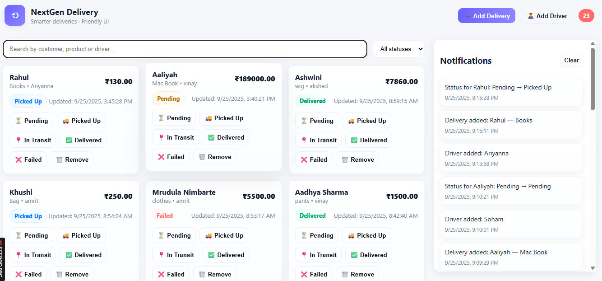
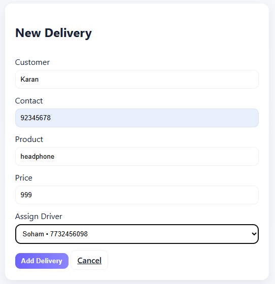
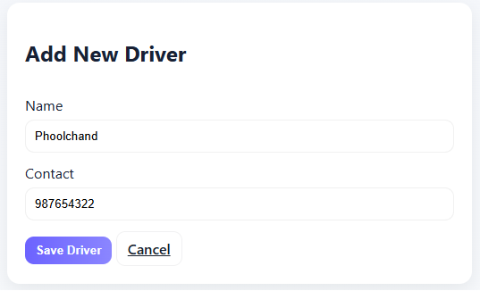
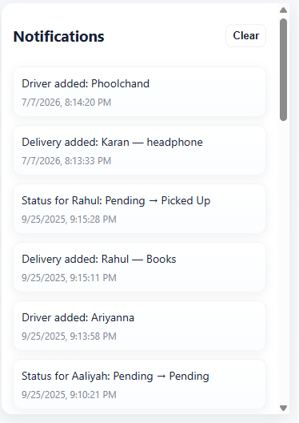

# 🚚 New Gen Delivery Tracker Dashboard

A Flask-based delivery management dashboard that enables users to monitor, manage, and track deliveries through an intuitive web interface. The application provides real-time shipment tracking, delivery status updates, and efficient order management for streamlined logistics operations.

🌐 **Live Demo:** https://new-gen-delivery-tracker-dashboard-1.onrender.com/

---

## ✨ Features

- 📦 Manage delivery records
- 🚚 Track shipment status
- 📍 Delivery progress monitoring
- 📊 Interactive dashboard
- 🔍 Search and organize deliveries
- 💾 SQLite database integration
- 📱 Responsive web interface
- ⚡ Fast and lightweight Flask application

---

## 📸 Screenshots

### 🏠 Dashboard



---

### 📦 Delivery Management



---

### 🚚 Driver Registration



---

### 📊 Notfication bar



---

## 🛠️ Tech Stack

- **Frontend:** HTML5, CSS3, JavaScript
- **Backend:** Python, Flask
- **Database:** SQLite
- **Deployment:** Render
- **Version Control:** Git & GitHub

---

## 🚀 Getting Started

### Clone the Repository

```bash
git clone https://github.com/aaliyahalics23021/New_Gen-Delivery-Tracker-Dashboard.git
cd New_Gen-Delivery-Tracker-Dashboard
```

### Install Dependencies

```bash
pip install -r requirements.txt
```

### Run the Application

```bash
python app.py
```

Open your browser and visit:

```text
http://127.0.0.1:5000
```

---

## 📂 Project Structure

```text
New_Gen-Delivery-Tracker-Dashboard/
│── static/
│── templates/
│── app.py
│── deliveries.db
│── schema.sql
│── requirements.txt
│── README.md
```

---

## 🎯 Key Features

- Delivery tracking dashboard
- Delivery record management
- SQLite database support
- Responsive interface
- Simple and clean user experience
- Easy deployment using Render

---

## 🌐 Live Demo

**Website:** https://new-gen-delivery-tracker-dashboard-1.onrender.com/

---

## 📌 Future Enhancements

- User authentication
- Email/SMS delivery notifications
- Route optimization
- Interactive maps integration
- Delivery analytics and reports
- Admin dashboard with role-based access

---

## 👩‍💻 Author

**Aaliyah Ali**

GitHub: https://github.com/aaliyahalics23021
